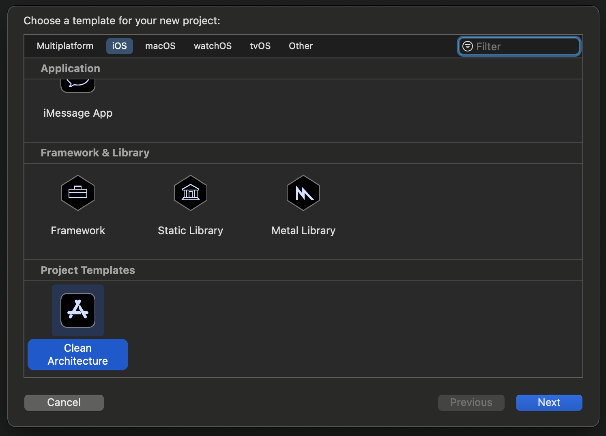

# iOS Clean Architecture (MVVM + RxSwift)

## Installation
```
$ pod install
```

## High Level Overview


* **Domain Layer**: Entities + Use Cases + Gateway Protocols
* **Data Layer**: Gateway Implementations + API (Network) + Database
* **Presentation Layer**: ViewModels + Views  + Navigator + Scene Use Cases

**Dependency Direction**


## Detail Overview


### Domain Layer


#### Entities
Entities encapsulate enterprise-wide Critical Business Rules. An entity can be an object with methods, or it can be a set of data structures and functions. It doesn’t matter so long as the entities can be used by many different applications in the enterprise. - _Clean Architecture: A Craftsman's Guide to Software Structure and Design (Robert C. Martin)_

Entities are simple data structures:

```swift
struct Product {
    var id = 0
    var name = ""
    var price = 0.0
}
```

#### Use Cases

The software in the use cases layer contains application-specific business rules. It encapsulates and implements all of the use cases of the system. These use cases orchestrate the flow of data to and from the entities, and direct those entities to use their Critical Business Rules to achieve the goals of the use case. - _Clean Architecture: A Craftsman's Guide to Software Structure and Design (Robert C. Martin)_

UseCases are protocols which do one specific thing:

```swift
protocol GettingProductList {
    var productGateway: ProductGatewayType { get }
}

extension GettingProductList {
    func getProductList(dto: GetPageDto) -> Observable<PagingInfo<Product>> {
        return productGateway.getProductList(dto: dto)
    }
}
```

#### Gateway Protocols
Generally gateway is just another abstraction that will hide the actual implementation behind, similarly to the Facade Pattern. It could a Data Store (the Repository pattern), an API gateway, etc. Such as Database gateways will have methods to meet the demands of an application. However do not try to hide complex business rules behind such gateways. All queries to the database should relatively simple like CRUD operations, of course some filtering is also acceptable. - [Source](https://crosp.net/blog/software-architecture/clean-architecture-part-2-the-clean-architecture/)

```swift
protocol ProductGatewayType {
    func getProductList(dto: GetPageDto) -> Observable<PagingInfo<Product>>
    func deleteProduct(dto: DeleteProductDto) -> Observable<Void>
    func update(_ product: ProductDto) -> Observable<Void>
}
```

_Note: For simplicity we put the Gateway protocols and implementations in the same files. In fact, Gateway protocols should be at the Domain Layer and implementations at the Data Layer._

### Data Layer


Data Layer contains Gateway Implementations and one or many Data Stores. Gateways are responsible for coordinating data from different Data Stores. Data Store can be Remote or Local (for example persistent database). Data Layer depends only on the Domain Layer.

#### Gateway Implementations

```swift
struct ProductGateway: ProductGatewayType {
    func getProductList(dto: GetPageDto) -> Observable<PagingInfo<Product>> {
        return API.shared.getProductList(API.GetProductListInput())
            .map { PagingInfo(page: 1, items: $0) }
    }
    
    func deleteProduct(dto: DeleteProductDto) -> Observable<Void> { ... }
    func update(_ product: ProductDto) -> Observable<Void> { ... }
}
```

#### UserDefaults

```swift
enum AppSettings {
    @Storage(key: "didInit", defaultValue: false)
    static var didInit: Bool
}
```

#### APIs

```swift
extension API {
    func getRepoList(_ input: GetRepoListInput) -> Observable<GetRepoListOutput> {
        return request(input)
    }
}

// MARK: - GetRepoList
extension API {
    final class GetRepoListInput: APIInput {
        init(page: Int, perPage: Int = 10) {
            let params: JSONDictionary = [
                "q": "language:swift",
                "per_page": perPage,
                "page": page
            ]
            super.init(urlString: API.Urls.getRepoList,
                       parameters: params,
                       requestType: .get,
                       requireAccessToken: true)
        }
    }
    
    final class GetRepoListOutput: APIOutput {
        private(set) var repos: [Repo]?
        
        override func mapping(map: Map) {
            super.mapping(map: map)
            repos <- map["items"]
        }
    }
}
```

Map JSON Data to Domain Entities using ObjectMapper:

```swift
import ObjectMapper 

extension Product: Mappable {
    init?(map: Map) {
        self.init()
    }
    
    mutating func mapping(map: Map) {
        id <- map["id"]
        name <- map["name"]
        price <- map["price"]
    }
}
```

_Note: Again, for simplicity we put entities and mappings in the same files and use entities as data models for APIs. You can create data models for APIs and map to entities._

#### CoreData Repositories

Map CoreData Entities to Domain Entities and vice versa:

```swift
import MagicalRecord

protocol UserRepository: CoreDataRepository {
   
}

extension UserRepository where Self.ModelType == User, Self.EntityType == CDUser {
    func getUsers() -> Observable<[User]> {
        return all()
    }

    func add(dto: AddUserDto) -> Observable<Void> {
        guard let users = dto.users else { return Observable.empty() }
        return addAll(users)
    }
    
    static func map(from item: User, to entity: CDUser) {
        entity.id = item.id
        entity.name = item.name
        entity.gender = Int64(item.gender.rawValue)
        entity.birthday = item.birthday
    }
    
    static func item(from entity: CDUser) -> User? {
        guard let id = entity.id else { return nil }
        return User(
            id: id,
            name: entity.name ?? "",
            gender: Gender(rawValue: Int(entity.gender)) ?? Gender.unknown,
            birthday: entity.birthday ?? Date()
        )
    }
}
```

### Presentation Layer


In the current example, Presentation is implemented with the MVVM pattern and heavy use of RxSwift, which makes binding very easy.


#### ViewModel

* ViewModel is the main point of MVVM application. The primary responsibility of the ViewModel is to provide data to the view, so that view can put that data on the screen.
* It also allows the user to interact with data and change the data.
* The other key responsibility of a ViewModel is to encapsulate the interaction logic for a view, but it does not mean that all of the logic of the application should go into ViewModel.
* It should be able to handle the appropriate sequencing of calls to make the right thing happen based on user or any changes on the view.
* ViewModel should also manage any navigation logic like deciding when it is time to navigate to a different view.
[Source](https://www.tutorialspoint.com/mvvm/mvvm_responsibilities.htm)

ViewModel performs pure transformation of a user Input to the Output:

```swift
public protocol ViewModel {
    associatedtype Input
    associatedtype Output
    
    func transform(_ input: Input, disposeBag: DisposeBag) -> Output
}
```

```swift
struct ProductsViewModel {
    let navigator: ProductsNavigatorType
    let useCase: ProductsUseCaseType
}

// MARK: - ViewModel
extension ProductsViewModel: ViewModel {
    struct Input {
        let loadTrigger: Driver<Void>
        let reloadTrigger: Driver<Void> 
        let loadMoreTrigger: Driver<Void>
        let selectProductTrigger: Driver<IndexPath>
        let editProductTrigger: Driver<IndexPath>
        let deleteProductTrigger: Driver<IndexPath>
    }

    struct Output {
        @Property var error: Error?
        @Property var isLoading = false
        @Property var isReloading = false
        @Property var isLoadingMore = false
        @Property var productList = [ProductItemViewModel]()
        @Property var isEmpty = false
    }

    func transform(_ input: Input, disposeBag: DisposeBag) -> Output {
        let output = Output()
        
        let activityIndicator = PageActivityIndicator()
        let isLoading = activityIndicator.isLoading
        let isReloading = activityIndicator.isReloading
        
        let errorTracker = ErrorTracker()
        
        isLoading
            .drive(output.$isLoading)
            .disposed(by: disposeBag)
        
        isReloading
            .drive(output.$isReloading)
            .disposed(by: disposeBag)
        
        activityIndicator.isLoadingMore
            .drive(output.$isLoadingMore)
            .disposed(by: disposeBag)
        
        errorTracker.asDriver()
            .drive(output.$error)
            .disposed(by: disposeBag)
        
        let pageSubject = BehaviorRelay(value: PagingInfo<ProductModel>(page: 1, items: []))
        let updatedProductSubject = PublishSubject<Void>()
        
        let getPageInput = GetPageInput(
            pageSubject: pageSubject,
            pageActivityIndicator: activityIndicator,
            errorTracker: errorTracker,
            loadTrigger: input.loadTrigger,
            reloadTrigger: input.reloadTrigger,
            loadMoreTrigger: input.loadMoreTrigger,
            getItems: { _, page in
                let dto = GetPageDto().with { $0.page = page }
                return self.useCase.getProductList(dto: dto)
            },
            mapper: ProductModel.init(product:)
        )
        
        let getPageResult = getPage(input: getPageInput)
        
        let page = Driver.merge(
            getPageResult.page,
            updatedProductSubject
                .asDriverOnErrorJustComplete()
                .withLatestFrom(pageSubject.asDriver())
        )

        let productList = page
            .map { $0.items }
        
        productList
            .map { products in products.map(ProductItemViewModel.init) }
            .drive(output.$productList)
            .disposed(by: disposeBag)
        
        select(trigger: input.selectProductTrigger, items: productList)
            .do(onNext: { product in
                self.navigator.toProductDetail(product: product.product)
            })
            .drive()
            .disposed(by: disposeBag)
        
        select(trigger: input.editProductTrigger, items: productList)
            .map { $0.product }
            .flatMapLatest { product -> Driver<EditProductDelegate> in
                self.navigator.toEditProduct(product)
            }
            .do(onNext: { delegate in
                switch delegate {
                case .updatedProduct(let product):
                    let page = pageSubject.value
                    var productList = page.items
                    let productModel = ProductModel(product: product, edited: true)
                    
                    if let index = productList.firstIndex(of: productModel) {
                        productList[index] = productModel
                        let updatedPage = PagingInfo(page: page.page, items: productList)
                        pageSubject.accept(updatedPage)
                        updatedProductSubject.onNext(())
                    }
                }
            })
            .drive()
            .disposed(by: disposeBag)

        checkIfDataIsEmpty(trigger: Driver.merge(isLoading, isReloading),
                           items: productList)
            .drive(output.$isEmpty)
            .disposed(by: disposeBag)
        
        select(trigger: input.deleteProductTrigger, items: productList)
            .map { $0.product }
            .flatMapLatest { product -> Driver<Product> in
                return self.navigator.confirmDeleteProduct(product)
                    .map { product }
            }
            .flatMapLatest { product -> Driver<Product> in
                return self.useCase.deleteProduct(dto: DeleteProductDto(id: product.id))
                    .trackActivity(activityIndicator.loadingIndicator)
                    .trackError(errorTracker)
                    .map { _ in product }
                    .asDriverOnErrorJustComplete()
            }
            .do(onNext: { product in
                let page = pageSubject.value
                
                var productList = page.items
                productList.removeAll { $0.product.id == product.id }
                
                let updatedPage = PagingInfo(page: page.page, items: productList)
                pageSubject.accept(updatedPage)
            })
            .drive()
            .disposed(by: disposeBag)
        
        return output
    }
}
```

A ViewModel can be injected into a ViewController via property injection or initializer. In the current example, this is done by Assembler.

```swift
protocol ProductsAssembler {
    func resolve(navigationController: UINavigationController) -> ProductsViewController
    ...
}

extension ProductsAssembler {
    func resolve(navigationController: UINavigationController) -> ProductsViewController {
        let vc = ProductsViewController.instantiate()
        let vm: ProductsViewModel = resolve(navigationController: navigationController)
        vc.bindViewModel(to: vm)
        return vc
    }
	   
    ...
}
```

ViewModels provide data and functionality to be used by views:

```swift
struct UserItemViewModel {
    let name: String
    let gender: String
    let birthday: String
    
    init(user: User) {
        self.name = user.name
        self.gender = user.gender.name
        self.birthday = user.birthday.dateString()
    }
}
```

#### Scene Use Case
Scene Use Case acts as an intermediary between the Presentation Layer and the Domain Layer. It includes individual use cases for each screen, which makes testing the ViewModel easier.

Scene Use Case uses the Facade pattern.

```swift
protocol ProductsUseCaseType {
    func getProductList(dto: GetPageDto) -> Observable<PagingInfo<Product>>
    func deleteProduct(dto: DeleteProductDto) -> Observable<Void>
}

struct ProductsUseCase: ProductsUseCaseType, GettingProductList, DeletingProduct {
    let productGateway: ProductGatewayType
}
```

#### ViewController

Data binding is performed in the bindViewModel method of the ViewController:

```swift
final class ProductsViewController: UIViewController, Bindable {
    ...
    
    var viewModel: ProductsViewModel!
    
    private var editProductTrigger = PublishSubject<IndexPath>()
    private var deleteProductTrigger = PublishSubject<IndexPath>()
    
    ...
    
    func bindViewModel() {
        let input = ProductsViewModel.Input(
            loadTrigger: Driver.just(()),
            reloadTrigger: tableView.refreshTrigger,
            loadMoreTrigger: tableView.loadMoreTrigger,
            selectProductTrigger: tableView.rx.itemSelected.asDriver(),
            editProductTrigger: editProductTrigger.asDriverOnErrorJustComplete(),
            deleteProductTrigger: deleteProductTrigger.asDriverOnErrorJustComplete()
        )
        
        let output = viewModel?.transform(input, disposeBag: rx.disposeBag)
        
        output?.$productList
            .asDriver()
            .drive(tableView.rx.items) { [unowned self] tableView, index, product in
                return tableView.dequeueReusableCell(
                    for: IndexPath(row: index, section: 0),
                    cellType: ProductCell.self)
                    .then {
                        $0.bindViewModel(product)
                        
                        $0.editProductAction = {
                            self.editProductTrigger.onNext(IndexPath(row: index, section: 0))
                        }
                        
                        $0.deleteProductAction = {
                            self.deleteProductTrigger.onNext(IndexPath(row: index, section: 0))
                        }
                    }
            }
            .disposed(by: rx.disposeBag)
        
        output?.$error
            .asDriver()
            .unwrap()
            .drive(rx.error)
            .disposed(by: rx.disposeBag)
        
        output?.$isLoading
            .asDriver()
            .drive(rx.isLoading)
            .disposed(by: rx.disposeBag)
        
        output?.$isReloading
            .asDriver()
            .drive(tableView.isRefreshing)
            .disposed(by: rx.disposeBag)
        
        output?.$isLoadingMore
            .asDriver()
            .drive(tableView.isLoadingMore)
            .disposed(by: rx.disposeBag)
        
        output?.$isEmpty
            .asDriver()
            .drive(tableView.isEmpty)
            .disposed(by: rx.disposeBag)
    }
    
    ...
}
```

## Testing
### What to test?
In this architecture, we can test Use Cases, ViewModels and Entities (if they contain business logic) using RxTest.

#### Use Case

```swift
import RxTest

final class GettingProductListTests: XCTestCase, GettingProductList {
    var productGateway: ProductGatewayType {
        return productGatewayMock
    }
    
    private var productGatewayMock: ProductGatewayMock!
    private var disposeBag: DisposeBag!
    private var getProductListOutput: TestableObserver<PagingInfo<Product>>!
    private var scheduler: TestScheduler!

    override func setUpWithError() throws {
        disposeBag = DisposeBag()
        productGatewayMock = ProductGatewayMock()
        
        scheduler = TestScheduler(initialClock: 0)
        getProductListOutput = scheduler.createObserver(PagingInfo<Product>.self)
    }

    func test_getProductList() {
        // act
        self.getProductList(dto: GetPageDto(page: 1))
            .subscribe(getProductListOutput)
            .disposed(by: disposeBag)

        // assert
        XCTAssert(productGatewayMock.getProductListCalled)
        XCTAssertEqual(getProductListOutput.events.first?.value.element?.items.count, 1)
    }
    
    func test_getProductList_fail() {
        // assign
        productGatewayMock.getProductListReturnValue = Observable.error(TestError())

        // act
        self.getProductList(dto: GetPageDto(page: 1))
            .subscribe(getProductListOutput)
            .disposed(by: disposeBag)

        // assert
        XCTAssert(productGatewayMock.getProductListCalled)
        XCTAssertEqual(getProductListOutput.events, [.error(0, TestError())])
    }
}
```

#### ViewModel

```swift
import RxBlocking

final class ReposViewModelTests: XCTestCase {
    ...

    func test_loadTriggerInvoked_getRepoList() {
        // act
        loadTrigger.onNext(())
        
        // assert
        XCTAssert(useCase.getRepoListCalled)
        XCTAssertEqual(output.repoList.count, 1)
    }

    func test_loadTriggerInvoked_getRepoList_failedShowError() {
        // arrange
        useCase.getRepoListReturnValue = Observable.error(TestError())

        // act
        loadTrigger.onNext(())

        // assert
        XCTAssert(useCase.getRepoListCalled)
        XCTAssert(output.error is TestError)
    }
    
    func test_selectRepoTriggerInvoked_toRepoDetail() {
        // act
        loadTrigger.onNext(())
        selectRepoTrigger.onNext(IndexPath(row: 0, section: 0))

        // assert
        XCTAssert(navigator.toRepoDetailCalled)
    }

    ...
```

## Project Folder and File Structure

```
- /CleanArchitecture    
    - /Domain
        - /UseCases
            - /Product
                - GettingProductList.swift
                - UpdatingProduct.swift
                - DeletingProduct.swift
                ...
            - /Login
            - /App
            - /User
            - /Repo
        - /Entities
            - Product.swift
            - User.swift
            - Repo.swift
    - /Data
        - /Gateways
            - RepoGateway.swift
            - UserGateway.swift
            - AppGateway.swift
            ...
        - /UserDefaults
            - AppSettings.swift
        - /API
            - API+Product.swift
            - API+Repo.swift
        - /CoreData
            - UserRepository.swift
    - /Scenes
        - /App
        - /Main
        - /Login
        - /UserList
        - /Products
        ...
    - /Config
        - APIUrls.swift
    	- Notifications.swift
    - /Support
        - /Extension
            - UIViewController+.swift
            - UIViewController+Rx.swift
            - UITableView+.swift
            ...
        - Utils.swift
    - /Resources
        - /Assets.xcassets
    - AppDelegate.swift
    - Assembler.swift
    - ...

- /CleanArchitectureTests
    - /Domain
    - /Data
    - /Scenes
```


## Example


## Tutorials

* [Tutorial - Import Clean Architecture Project Template for Xcode](xcode_project_template.md)



* [Tutorial - Import Clean Architecture Templates for Xcode](xcode_templates.md)


* [Tutorial: Creating a skeleton project](skeleton.md)


## Code Generator
* [GitHub - tuan188/MGiGen: A code generator for iOS app](https://github.com/tuan188/MGiGen)


## Links
* [Clean Architecture (Combine + SwiftUI/UIKit)](https://github.com/tuan188/CleanArchitecture)
* [GitHub - sergdort/CleanArchitectureRxSwift: Example of Clean Architecture of iOS app using RxSwift](https://github.com/sergdort/CleanArchitectureRxSwift)
* [Testing Your RxSwift Code | raywenderlich.com](https://www.raywenderlich.com/7408-testing-your-rxswift-code)
* [Using Clean Architecture in Flutter - codeburst](https://codeburst.io/using-clean-architecture-in-flutter-d0437d0c7f87)
* [MVVM Responsibilities - Tutorialspoint](https://www.tutorialspoint.com/mvvm/mvvm_responsibilities.htm)
* [Dependency Injection in Swift - Making Tuenti - Medium](https://medium.com/makingtuenti/dependency-injection-in-swift-part-1-236fddad144a)
* [RxSwift: Clean Architecture, MVVM và RxSwift (Phần 1) - Viblo](https://viblo.asia/p/rxswift-clean-architecture-mvvm-va-rxswift-phan-1-gAm5yaR85db)
* [RxSwift: Clean Architecture, MVVM và RxSwift (Phần 2) - Viblo](https://viblo.asia/p/rxswift-clean-architecture-mvvm-va-rxswift-phan-2-E375zWR6KGW)
