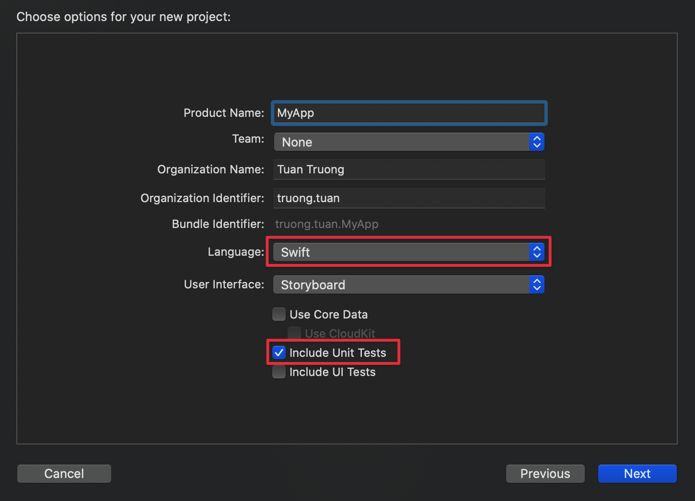

# Creating a Skeleton Project

To create a skeleton project named MyApp, do the following steps.

_Note: This tutorial applies to Xcode 11.5_

### Step 1:
Open Xcode and create a new project using Single View App template, choose Storyboard and Include Unit Tests.



### Step 2:
Delete `AppDelegate.swift`, `SceneDelete.swift`, `ViewController.swift` 


#### Step 3:
Remove Scene Configuration in `Info.plist`.


### Step 4:
Install  [igen](https://github.com/tuan188/MGiGen)  (v2.2.0 and above)

### Step 5:
Run command:

```
$ igen template skeleton MyApp
```

Result:


### Step 6:
Select and drag files and folders from Sources to MyApp project. Choose Create Bridging Header.


### Step 7:
Copy other files created in step 5 to the project folder (except `Localizable.strings`, `MyApp-Bridging-Header.h`).


### Step 8:
Copy the content of `MyApp-Bridging-Header.h` into the corresponding file in the project


### Step 9:
Rename `gitignore` to `.gitignore` and `swiftlint.yml` to `.swiftlint.yml` using Terminal:

```
$ mv gitignore .gitignore        
$ mv swiftlint.yml .swiftlint.yml
```

### Step 10:
Run:

```
$ pod install
```

### Step 11:
Open `MyApp.xcworkspace` and add a new Run Script Phase:

```
if which swiftlint >/dev/null; then
  swiftlint
else
  echo "warning: SwiftLint not installed, download from https://github.com/realm/SwiftLint"
fi
```


Done.
